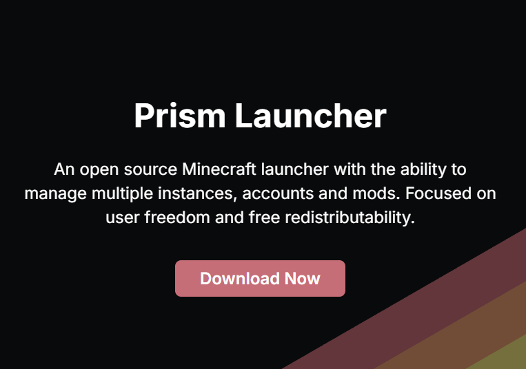
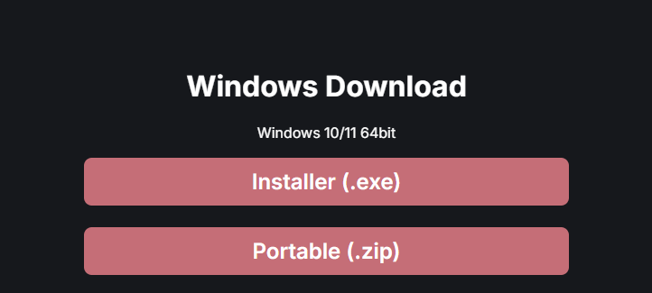
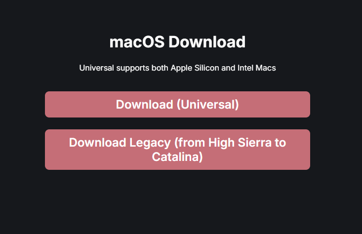
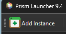
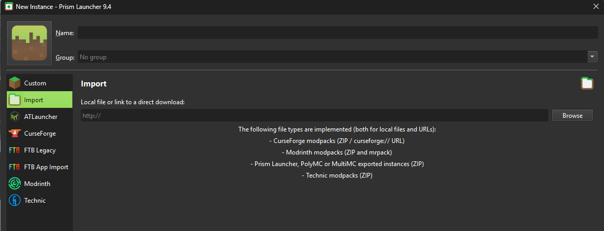
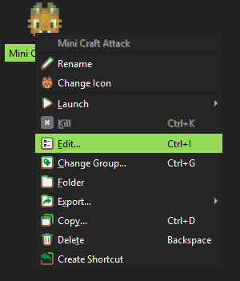
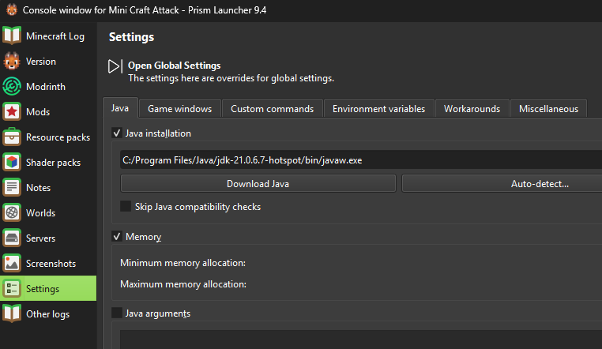
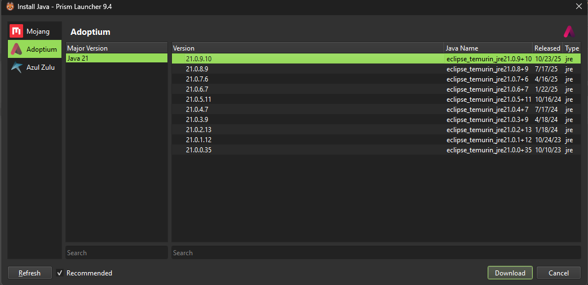
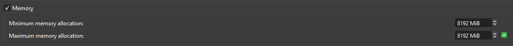

# 🌍 MiniCraftAttack Modpack Installations-Guide (Prism Launcher)

Folge der Anleitung Schritt für Schritt, um das Modpack korrekt zu installieren und dem Server beizutreten.

---

## ✅ 1. Prism Launcher herunterladen

Falls du Prism Launcher noch nicht installiert hast, lade ihn hier herunter:

🔗 https://prismlauncher.org/download/

**Download Button:**  

### 📥 Download (Windows & macOS)

> Wähle die Version passend zu deinem Betriebssystem.

**Windows Download Beispiel:**  

**macOS Download Beispiel:**  

---

## 👤 2. Minecraft Account in Prism Launcher hinzufügen

Falls du den Prism Launcher zum ersten Mal startest, musst du deinen Minecraft Account hinzufügen:

1. Prism Launcher starten  
2. Oben rechts auf **Accounts** klicken  
3. **Add Microsoft Account** auswählen  
4. Microsoft Login durchführen
   
---

## 📦 3. Modpack importieren

1. Prism Launcher öffnen  
2. **Neue Instanz hinzufügen** klicken  
3. **Importieren** auswählen  
4. Das Modpack `.zip` auswählen, das du erhalten hast  
5. Warten, bis die Installation abgeschlossen ist  

---

## 🔧 4. Instanz bearbeiten & Java Version prüfen

Damit das Modpack optimal läuft, solltest du die Java-Version überprüfen:

1. Rechtsklick auf die Modpack-Instanz → **Bearbeiten**
2. Links auf **Java** gehen
3. Wenn keine Java-Version vorhanden ist, **"Add" / "Auto-detect" / "Download"** verwenden  
   (Empfohlene Version: **Java 21.0.9.10** von Adoptium)

---

## 🧠 5. RAM zuweisen (sehr wichtig)

Modpacks benötigen mehr RAM als Vanilla Minecraft.

1. In der Instanz → **Settings / Einstellungen**
2. **Speicher / Memory** wählen
3. RAM einstellen

### 💡 Empfehlung:

| System | RAM zuweisen |
|--------|----------------|
| 8 GB RAM | 4096 MB |
| 16 GB RAM | 6192-8192 MB |
| 32+ GB RAM | 8192 MB |

> ⚠️ **Wichtig:** Nicht mehr als 50% deines System-RAM an Minecraft geben!

---

## 🚀 Starten & Spaß haben

Wenn alles eingerichtet ist, einfach die Instanz starten und dem Server beitreten!

---

## 🙋 Support

Wenn etwas nicht funktioniert oder du Hilfe brauchst, melde dich bei mir **hatyyy** im Discord.  

